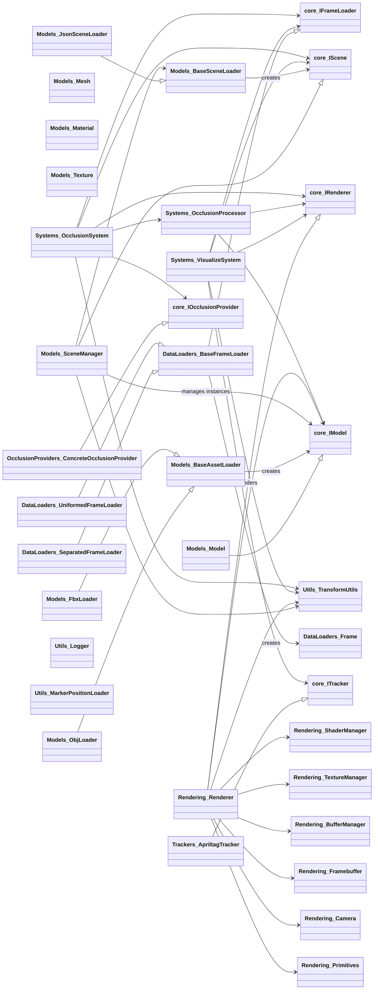

# Refactoring Plan for MR Occlusion Framework

## 1. Introduction

This document outlines a refined refactoring plan for the MR Occlusion Framework. It builds upon the excellent analysis and proposals presented in the original `Systems/RefactorLog.md`.

The primary goals of this refactoring effort are:
*   **Code Deduplication:** Eliminate redundant code, especially in rendering, model loading, and transformation logic.
*   **Improved Modularity:** Create well-defined, independent modules with clear responsibilities.
*   **Clear Separation of Concerns:** Ensure each component focuses on a specific aspect of the system.
*   **Adoption of Modern OpenGL Practices:** Transition to a shader-based, modern OpenGL pipeline for all rendering tasks.
*   **Enhanced Maintainability & Extensibility:** Make the codebase easier to understand, modify, and extend with new features or algorithms.

## 2. Key Issues Addressed

This refactoring addresses the following key issues identified in the current codebase:
*   **Duplicate OpenGL Implementation:** Multiple, distinct OpenGL initializations and rendering logics.
*   **Mixed Rendering Code:** Similar rendering tasks implemented in different ways across modules.
*   **Duplicate Transform Processing:** Transformation logic (position, rotation, scale) repeated in several classes.
*   **Different OpenGL Approaches:** Coexistence of legacy (immediate mode) and modern (shader-based) OpenGL.
*   **Duplicate Model Loading:** Model data loading and parsing logic scattered across different components.
*   **Unclear Module Responsibilities:** Ambiguous boundaries for some classes, leading to tangled dependencies.

## 3. Proposed New Architecture

### 3.1. Overall Directory Structure

The proposed new directory structure is as follows:

```
MR_Occlusion_Framework/
├── core/                      # Core interfaces (abstract base classes)
│   ├── IFrameLoader.py
│   ├── IOcclusionProvider.py
│   ├── IModel.py
│   ├── IRenderer.py
│   ├── IScene.py
│   └── ITracker.py
├── DataLoaders/               # Data loading (frames, sensor data)
│   ├── Frame.py               # (Moved from Interfaces/)
│   ├── BaseFrameLoader.py     # (Optional: ABC for different frame sources)
│   ├── UniformedFrameLoader.py # (Current Systems/DataLoader.py logic)
│   └── SeparatedFrameLoader.py # (For future DepthIMUData3 structure)
├── Models/                    # 3D Model and Scene representation/management
│   ├── Model.py               # Unified 3D model data structure (vertices, normals, uvs, materials, etc.)
│   ├── Mesh.py                # Individual mesh component of a Model
│   ├── Material.py            # Material properties
│   ├── Texture.py             # Texture data
│   ├── BaseSceneLoader.py     # ABC for scene description loaders
│   ├── JsonSceneLoader.py     # Loads scene structure from JSON (current Systems/ModelLoader.py JSON logic)
│   ├── SceneManager.py        # Manages scene graph, object instances, and their transforms
│   ├── BaseAssetLoader.py     # ABC for specific model file format loaders
│   ├── FbxLoader.py           # Loads FBX files into Model/Mesh structure
│   └── ObjLoader.py           # Loads OBJ files into Model/Mesh structure
├── Rendering/                 # Unified Modern OpenGL Rendering Subsystem
│   ├── Renderer.py            # Main rendering class (modern OpenGL, shader-based)
│   ├── ShaderManager.py       # Manages GLSL shader programs
│   ├── TextureManager.py      # Manages OpenGL textures
│   ├── BufferManager.py       # Manages VBOs, EBOs, VAOs
│   ├── Framebuffer.py         # Framebuffer Object (FBO) management
│   ├── Camera.py              # Camera class for view/projection matrices
│   └── Primitives.py          # For drawing basic shapes (grid, axes, debug visuals)
├── Systems/                   # High-level system coordinators
│   ├── OcclusionSystem.py     # (Refactored from current Systems/BaseSystem.py)
│   ├── VisualizeSystem.py     # (Refactored to use new Rendering/ and Models/ subsystems)
│   └── OcclusionProcessor.py  # Handles occlusion logic, uses Renderer for MR content depth
├── Trackers/                  # Tracking implementations
│   └── ApriltagTracker.py     # (Moved from Tracker/)
├── OcclusionProviders/        # Occlusion algorithm implementations
│   ├── DepthThresholdOcclusion.py # (Example, moved from Occlusions/)
│   └── SimpleOcclusion.py     # (Example, moved from Occlusions/)
└── Utils/                     # Common utilities
    ├── TransformUtils.py      # For matrix operations, quaternion/Euler, etc.
    ├── Logger.py              # (Moved from Logger/)
    └── MarkerPositionLoader.py # (No change or integrate into a SceneAsset type)
```

### 3.2. Component Responsibilities

*   **`core/`**: Defines abstract base classes (interfaces) for key components. This promotes polymorphism and allows for different implementations to be swapped easily.
*   **`DataLoaders/`**: Handles loading of all time-series sensor data (RGB, depth, IMU) and constructs `Frame` objects. `Frame.py` will be the standardized data structure for per-timestamp data.
*   **`Models/`**: Centralizes loading, representation, and management of all 3D assets (models, meshes, materials, textures) and scene graph information.
    *   `Model.py` & `Mesh.py`: Define the in-memory representation of 3D geometry.
    *   `FbxLoader.py` & `ObjLoader.py`: Concrete implementations for parsing specific file formats into the `Model/Mesh` structure.
    *   `JsonSceneLoader.py`: Parses scene description files (e.g., object placements, model IDs).
    *   `SceneManager.py`: Manages the collection of model instances within a scene, their transformations, and relationships.
*   **`Rendering/`**: A single, modern, shader-based OpenGL rendering engine.
    *   `Renderer.py`: The main class, orchestrating rendering passes. It will support rendering to screen (for visualization) and to off-screen framebuffers (for depth calculation, final compositing).
    *   `ShaderManager.py`, `TextureManager.py`, `BufferManager.py`: Manage OpenGL resources efficiently.
    *   `Camera.py`: Handles view and projection matrix calculations.
    *   `Primitives.py`: Utility for drawing simple geometric shapes for debugging or visualization aids.
    *   The functionality of the current `ContentsDepthCal.py` will be integrated as a specific rendering pass or capability of this `Renderer.py`.
*   **`Systems/`**: High-level classes that orchestrate the overall workflow.
    *   `OcclusionSystem.py`: The main entry point for the occlusion processing pipeline.
    *   `VisualizeSystem.py`: The main entry point for the 3D visualization.
    *   `OcclusionProcessor.py`: Encapsulates the logic for generating occlusion masks, utilizing the `Rendering/` subsystem to get depth maps of virtual content.
*   **`Trackers/` & `OcclusionProviders/`**: Contain concrete implementations of the `ITracker` and `IOcclusionProvider` interfaces, respectively.
*   **`Utils/`**: Houses shared utility modules like `TransformUtils.py` for mathematical operations and the existing `Logger.py`.

## 4. Key Changes & Benefits

*   **Unified Modern OpenGL Pipeline:** A single, consistent, shader-based rendering engine in `Rendering/` will replace the multiple, mixed-approach OpenGL implementations. This improves performance, maintainability, and leverages modern graphics capabilities.
*   **Centralized Model and Scene Management:** The `Models/` subsystem provides a clear and unified way to load, represent, and manage 3D assets and scene structures, eliminating redundancy.
*   **Consolidated Transformation Logic:** `Utils/TransformUtils.py` will provide a central place for all 3D transformation mathematics, ensuring consistency and reducing errors.
*   **Clearer Module Boundaries:** The new directory and class structure enforces better separation of concerns, making the system easier to understand and modify.
*   **Improved Testability:** Well-defined interfaces and modular components facilitate unit testing.
*   **Enhanced Extensibility:** Adding new model formats, rendering techniques, or data sources becomes simpler due to the modular design and clear interfaces.

## 5. Mermaid Diagram (Class Relationships)



## 6. Implementation Steps (High-Level)

1.  **Define Core Interfaces:** Create all abstract base classes in the `core/` directory.
2.  **Implement Utilities:** Develop `Utils/TransformUtils.py` and move/verify `Utils/Logger.py`.
3.  **Develop Model Subsystem (`Models/`):**
    *   Define `Model.py`, `Mesh.py`, `Material.py`, `Texture.py`.
    *   Implement `BaseAssetLoader.py` and concrete loaders (`FbxLoader.py`, `ObjLoader.py`).
    *   Implement `BaseSceneLoader.py` and `JsonSceneLoader.py`.
    *   Develop `SceneManager.py`.
4.  **Develop Rendering Subsystem (`Rendering/`):**
    *   Implement `ShaderManager.py`, `TextureManager.py`, `BufferManager.py`, `Framebuffer.py`, `Camera.py`, and `Primitives.py`.
    *   Implement the main `Renderer.py` using modern OpenGL, ensuring it can render models from the `Models/` subsystem and support depth-only rendering passes.
5.  **Refactor DataLoaders (`DataLoaders/`):**
    *   Move `Frame.py`.
    *   Implement `BaseFrameLoader.py` (if deemed beneficial for future loader types).
    *   Refactor existing data loading logic into `UniformedFrameLoader.py`.
6.  **Refactor Concrete Implementations:**
    *   Move and adapt `Trackers/ApriltagTracker.py`.
    *   Move and adapt implementations in `OcclusionProviders/`.
7.  **Refactor Systems (`Systems/`):**
    *   Refactor `OcclusionSystem.py` and `VisualizeSystem.py` to utilize the new subsystems and interfaces.
    *   Implement `OcclusionProcessor.py`.
8.  **Testing:** Conduct thorough unit and integration testing at each stage to ensure correctness and stability.

## 7. Conclusion

This refactoring aims to create a more robust, maintainable, and extensible foundation for the MR Occlusion Framework. By addressing current architectural issues and adopting modern software design principles, the framework will be better positioned for future development and enhancements.